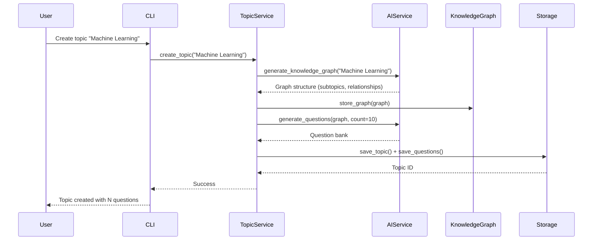
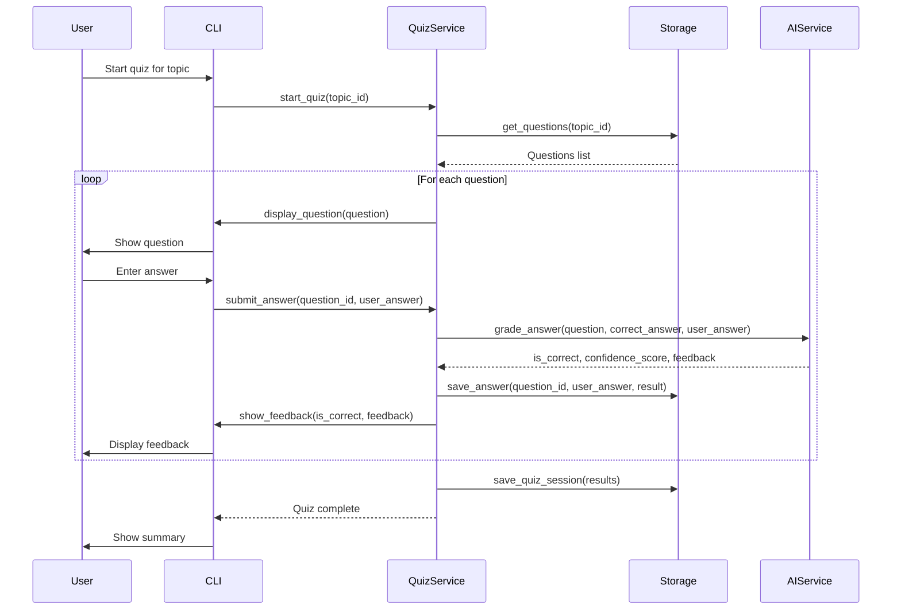

# Inkling

A learning application that allows users to set up custom topics, define knowledge graphs, and quiz themselves on AI-generated questions.

## Features

- **Custom Topics**: Create learning topics with AI-generated knowledge graphs
- **Knowledge Graphs**: Automatic generation of subtopics and relationships using Neo4j
- **AI-Generated Questions**: Question banks automatically generated from knowledge graphs
- **LLM-Based Grading**: Answers are graded using AI for nuanced feedback
- **Progress Tracking**: Track your understanding across topics and subtopics
- **Interactive CLI**: Beautiful terminal interface with rich formatting

## Requirements

- Python 3.10+
- Neo4j (for knowledge graph storage)
  - For embedded mode: Java runtime required
  - For remote mode: Neo4j server running
- AI Provider API key (OpenAI or Anthropic) or local LLM setup (Ollama)

## Installation

1. Install dependencies using `uv`:
   ```bash
   uv pip install -e .
   ```

2. Configure the application by editing `config.yaml`:
   - Set your AI provider (openai, anthropic, or local)
   - Configure API keys via environment variables:
     - `OPENAI_API_KEY` for OpenAI
     - `ANTHROPIC_API_KEY` for Anthropic
   - Configure Neo4j connection settings

3. Set up Neo4j:
   - For embedded mode: Ensure Java is installed
   - For remote mode: Start Neo4j server and update connection settings in `config.yaml`

## Usage

Run the application:
```bash
python main.py
```

### Main Features

1. **Create New Topic**: 
   - Enter a topic name
   - The system generates a knowledge graph with subtopics
   - Questions are automatically generated based on the knowledge graph

2. **Start Quiz**:
   - Select a topic
   - Answer questions interactively
   - Receive AI-graded feedback with explanations

3. **View Topics**: Browse all created topics

4. **View Quiz History**: Review past quiz attempts and performance

## Data Flow

### Topic Creation Flow

When creating a new topic, the system follows this sequence:



### Quiz Flow

When taking a quiz, the system follows this sequence:



## Configuration

Edit `config.yaml` to customize:
- AI provider and model selection
- Neo4j connection settings
- Default question count
- Quiz questions per session
- Grading strictness

## Project Structure

```
inkling/
├── main.py                 # Entry point
├── config.yaml            # Configuration file
├── pyproject.toml         # Dependencies
├── src/inkling/
│   ├── models.py          # Data models
│   ├── config.py          # Configuration management
│   ├── ai_service.py      # AI provider abstraction
│   ├── knowledge_graph.py # Neo4j operations
│   ├── storage.py         # SQLite persistence
│   ├── topic_service.py   # Topic creation
│   ├── quiz_service.py    # Quiz logic
│   └── cli.py             # Interactive interface
└── data/
    ├── inkling.db         # SQLite database
    └── neo4j/             # Neo4j data directory
```

## Data Storage

- **SQLite**: Stores topics, questions, answers, and quiz sessions in `data/inkling.db`
- **Neo4j**: Stores knowledge graph structure with relationships between topics and subtopics

## Notes

- AI API keys should be stored in environment variables or `.env` file for security
- Embedded Neo4j requires Java runtime - ensure it's installed if using embedded mode
- LLM grading provides nuanced feedback based on conceptual understanding, not just exact matches
