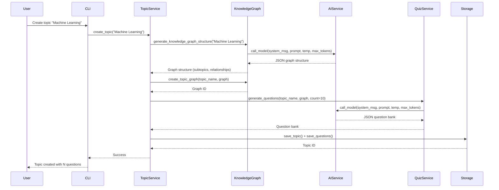
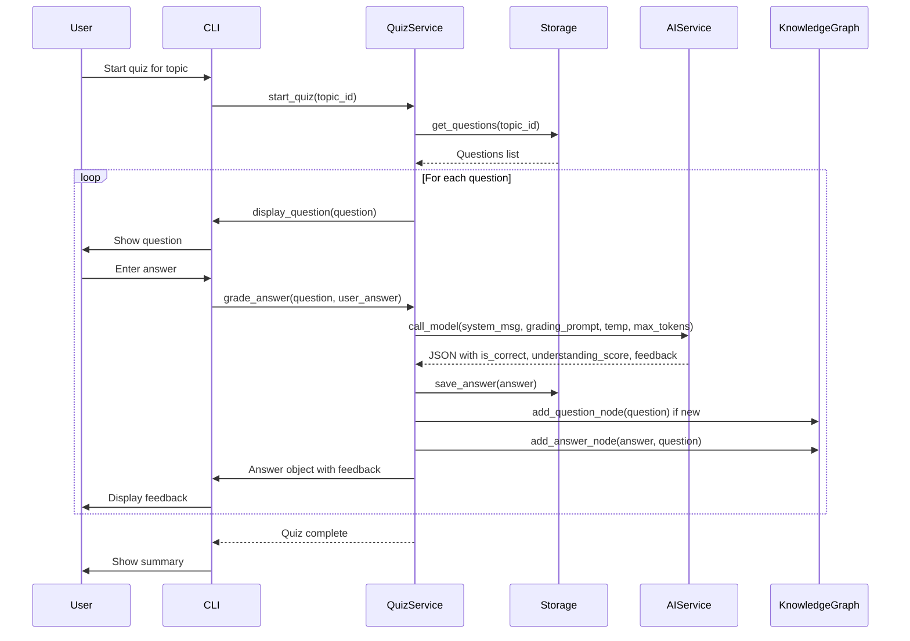

# Inkling

A learning application that allows users to set up custom topics, define knowledge graphs, and quiz themselves on AI-generated questions.

## Features

- **Custom Topics**: Create learning topics with AI-generated knowledge graphs
- **Knowledge Graphs**: Automatic generation of subtopics and relationships using Neo4j
- **AI-Generated Questions**: Question banks automatically generated from knowledge graphs
- **LLM-Based Grading**: Answers are graded using AI for nuanced feedback
- **Progress Tracking**: Track your understanding across topics and subtopics
- **Interactive CLI**: Beautiful terminal interface with rich formatting

## Requirements

- Python 3.10+
- Neo4j server running locally (for knowledge graph storage)
- AI Provider API key (OpenAI, Anthropic, or OpenRouter) or local LLM setup (Ollama)

## Installation

1. Install dependencies using `uv`:
   ```bash
   uv pip install -e .
   ```

2. Configure the application:
   - Edit `config.yaml` to set your AI provider (openai, anthropic, openrouter, or local)
   - Create a `.env` file from `.env.sample` and set your API keys:
     - `OPENAI_API_KEY` for OpenAI
     - `ANTHROPIC_API_KEY` for Anthropic
     - `OPENROUTER_API_KEY` for OpenRouter
     - `NEO4J_USERNAME` and `NEO4J_PASSWORD` for Neo4j connection
   - Configure Neo4j URI in `config.yaml` (defaults to `neo4j://127.0.0.1:7687`)

3. Set up Neo4j:
   - Start your Neo4j server locally
   - Ensure the connection URI in `config.yaml` matches your Neo4j instance

## Usage

Run the application:
```bash
python main.py
```

### Main Features

1. **Create New Topic**: 
   - Enter a topic name
   - The system generates a knowledge graph with subtopics
   - Questions are automatically generated based on the knowledge graph

2. **Start Quiz**:
   - Select a topic
   - Answer questions interactively
   - Receive AI-graded feedback with explanations

3. **View Topics**: Browse all created topics

4. **View Quiz History**: Review past quiz attempts and performance

5. **Generate Additional Questions**: Generate new questions based on learning gaps and existing knowledge

## Data Flow

### Topic Creation Flow

When creating a new topic, the system follows this sequence:



### Quiz Flow

When taking a quiz, the system follows this sequence:



## Configuration

### config.yaml

Edit `config.yaml` to customize:
- **AI Provider**: Choose from `openai`, `anthropic`, `openrouter`, or `local`
- **AI Model Parameters**: Configure temperature and max_tokens for:
  - Knowledge graph generation
  - Question generation
  - Answer grading
- **Neo4j Connection**: Set the connection URI (default: `neo4j://127.0.0.1:7687`)
- **Application Settings**:
  - `default_question_count`: Number of questions generated when creating a topic
  - `quiz_questions_per_session`: Number of questions per quiz session
  - `additional_questions_count`: Number of questions generated when using "Generate Additional Questions"
  - `grading_strictness`: Options: `strict`, `moderate`, `lenient`

### Environment Variables (.env)

Create a `.env` file (use `.env.sample` as a template) with:
- `OPENAI_API_KEY`: Your OpenAI API key (if using OpenAI provider)
- `ANTHROPIC_API_KEY`: Your Anthropic API key (if using Anthropic provider)
- `OPENROUTER_API_KEY`: Your OpenRouter API key (if using OpenRouter provider)
- `NEO4J_USERNAME`: Neo4j username (default: `neo4j`)
- `NEO4J_PASSWORD`: Neo4j password

## Project Structure

```
inkling/
├── main.py                 # Entry point
├── config.yaml            # Configuration file
├── .env.sample            # Environment variables template
├── pyproject.toml         # Dependencies
├── src/inkling/
│   ├── models.py          # Data models
│   ├── config.py          # Configuration management
│   ├── ai_service.py      # AI provider abstraction (connection only)
│   ├── knowledge_graph.py # Neo4j operations & knowledge graph generation
│   ├── storage.py         # SQLite persistence
│   ├── topic_service.py   # Topic creation orchestration
│   ├── quiz_service.py    # Quiz logic & question generation
│   └── cli.py             # Interactive interface
├── tests/                 # Test files
│   ├── test_ai_service.py
│   └── test_knowledge_graph.py
├── utils/                 # Utility scripts
│   ├── migrate_answers_table.py
│   └── visualize_knowledge_graph.py
└── data/
    └── inkling.db         # SQLite database
```

## Data Storage

- **SQLite**: Stores topics, questions, answers, and quiz sessions in `data/inkling.db`
  - Answers include `understanding_score` (1-5 scale) instead of confidence scores
- **Neo4j**: Stores knowledge graph structure with relationships between topics, subtopics, questions, and answers
  - Connects to a local Neo4j instance (not embedded mode)
  - Credentials are managed via environment variables

## Architecture Notes

- **AI Service Refactoring**: The `ai_service.py` module now only handles AI provider connections. All business logic (prompts, question generation, grading) has been moved to `knowledge_graph.py` and `quiz_service.py` respectively.
- **Configuration**: AI generation parameters (temperature, max_tokens) are now centralized in `config.yaml` under the `ai` section.
- **Knowledge Graph Updates**: The knowledge graph is dynamically updated when users answer questions, adding `Question` and `Answer` nodes to track learning progress.
- **Intelligent Question Selection**: Quiz questions are prioritized based on learning gaps (never answered → incorrectly answered → correctly answered).

## Notes

- AI API keys should be stored in the `.env` file for security (never commit this file)
- Neo4j must be running locally before starting the application
- LLM grading provides nuanced feedback based on conceptual understanding, using a 1-5 understanding score scale
